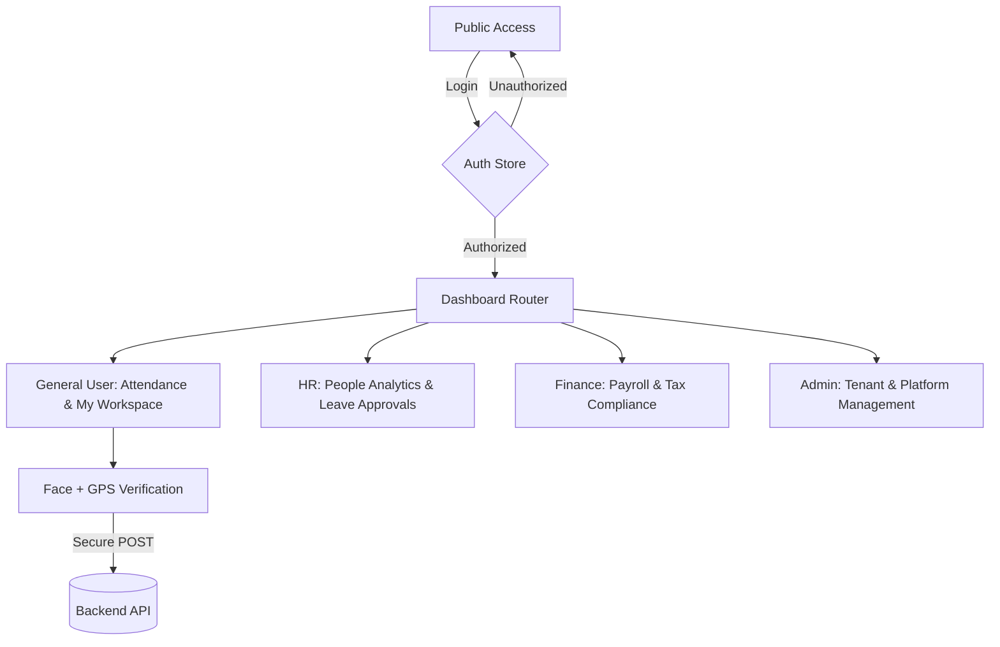
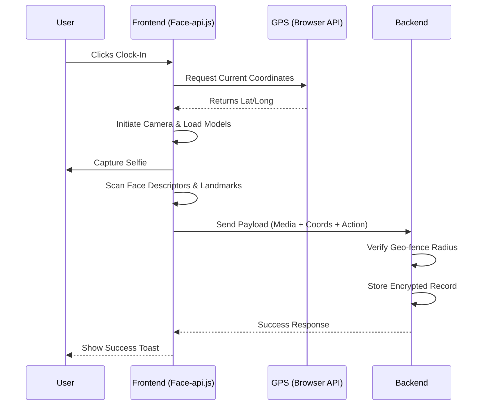

# Attendance Management System (Enterprise Edition 2026)

A cutting-edge, high-performance Attendance and People Analytics platform built with **Next.js 15+** and **Tailwind CSS 4**. This application is designed for modern enterprises, featuring a "Floating App Shell" architecture and robust biometric verification.

## 🚀 Recent Major Updates

### 1. Next-Gen UI/UX Overhaul (2026 Aesthetic)
- **Floating App Shell:** Abandoned traditional rigid layouts for a sleek, containerized "floating" workspace with `rounded-[40px]` corners and multi-layered soft shadows.
- **Glassmorphism Integration:** Implemented real-time `backdrop-blur` headers and sidebar elements for a premium, airy feel.
- **Responsive Sidebar:** Redesigned minimalist sidebar with intelligent active-state indicators and nested navigation support.

### 2. Advanced People Analytics
- **Role-Specific Dashboards:** Custom analytics suites for **Admin, HR, and Finance** roles.
- **Interactive Heatmaps:** High-density attendance visualization using ApexCharts to identify workforce peak arrival times.
- **Employee Performance Matrix:** A data-driven approach to tracking punctuality, attendance scores, and behavioral patterns.
- **Individual Drill-down:** Deep-dive modal for per-employee analytics including behavioral "DNA" radar charts.

### 3. Payroll & Automated Compliance
- **Modern Payslip Engine:** A redesigned "Digital Receipt" style payslip modal.
- **Native PDF Export:** Implementation of browser-optimized `@media print` for high-fidelity, selectable PDF generation.
- **Regulatory Compliance:** Built-in support for Indonesia's latest **TER PPh 21** tax schemes and **BPJS** social security regulations.

## 🛠 Technology Stack

- **Framework:** Next.js 15 (Turbopack)
- **Styling:** Tailwind CSS 4
- **State Management:** Zustand
- **Charts:** ApexCharts
- **Biometrics:** face-api.js (SSD Mobilenet V1 / Face Landmark 68)
- **HTTP Client:** Axios with Secure Interceptors
- **Icons:** Lucide React

## 🔄 Application Architecture & Flow

The system operates on a secure, role-based access control (RBAC) model.

## 📸 Attendance Verification Flow (GPS + Biometric)

To ensure zero-fraud attendance, the system employs a multi-factor verification heuristic.   

## 🔗 Backend Integration Details

### 1. Secure Request Lifecycle
All API calls are routed through a secure Axios instance located in `src/lib/axios.ts`.
- **Interceptors:** Automatically injects CSRF/Security headers.
- **Auth Handling:** Detects `401 Unauthorized` responses and triggers a graceful redirect to the login flow.

### 2. Data Flattening & Pagination
The system is optimized for large-scale employee data:
- **Server-side Pagination:** Integrated into the global `DataTable` component using `current_page`, `last_page`, and `total` metadata.
- **Transformation Layer:** Incoming nested JSON objects (e.g., `user` relation) are flattened during the fetch phase to ensure high-performance rendering and client-side searching.

## 🏁 Getting Started

1. **Environment Setup:** Copy `.env.example` to `.env` and configure your `NEXT_PUBLIC_API_URL`.
2. **Install Dependencies:** `npm install`
3. **Run Development:** `npm run dev`
4. **Build Production:** `npm run build`

---
*Developed with focus on Security, Performance, and Professional Aesthetics.*
